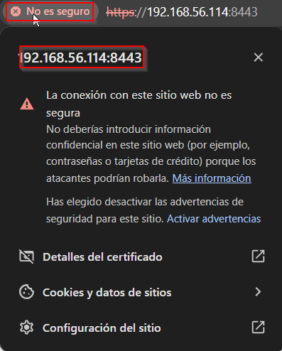
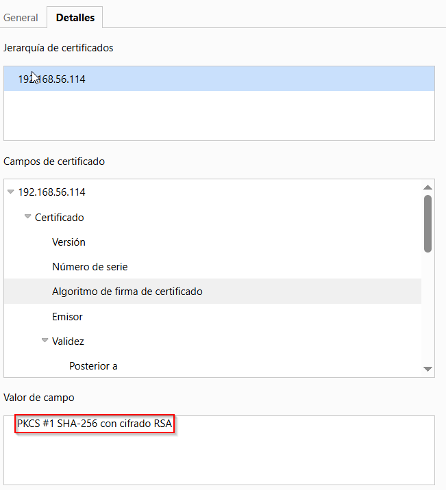
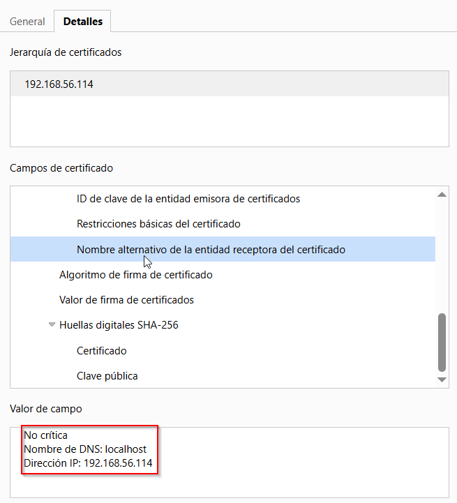
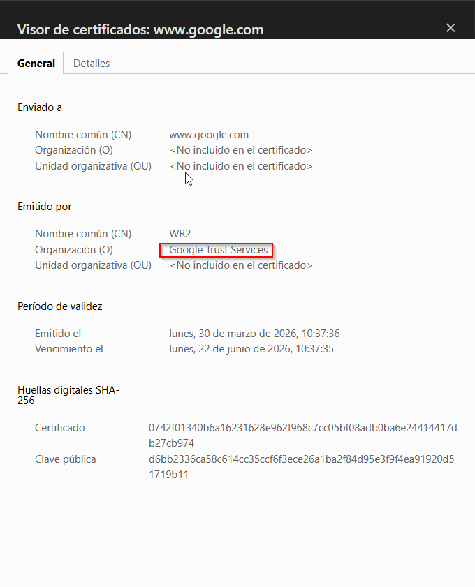
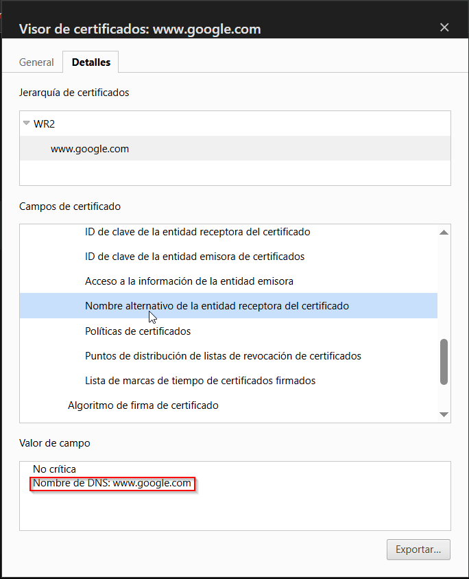

# Parte 2 

## 1. Contexto de la practica
- Via elegida: Simulada
- Sistema usado: Ubuntu Server 24.04.3 LTS
- Servidor web: Nginx
- Entorno: VM local (VirtualBox)
- Host evaluado: 192.168.56.114:8443
- Fecha de pruebas: 27/04/2026

## 2. Evidencias de configuracion HTTPS

### 2.1 Certificado propio y aviso del navegador
**Descripcion:** Se muestra el aviso del navegador al acceder al sitio con certificado autofirmado/no confiable.

**Analisis tecnico:**
- El navegador detecta que la cadena de confianza no termina en una CA reconocida.
- Si el certificado es autofirmado, no existe validacion externa de identidad del sitio.
- Esto no implica cifrado debil necesariamente; implica falta de confianza publica.

### 2.2 Datos del certificado propio
**Descripcion:** Se muestran los campos del certificado generado para el servidor local.

**Datos observados:**
- Subject (CN): 192.168.56.114
- Issuer: 192.168.56.114 (autofirmado)
- Validez: emitido el 27/04/2026 09:49:50 y vence el 27/04/2027 09:49:50
- Algoritmo de firma: PKCS #1 SHA-256 con cifrado RSA
- SAN (Subject Alternative Name): DNS localhost, IP 192.168.56.114
- Longitud de clave: 2048 bits (RSA)

### 2.3 Sitio web verificado (referencia)
**Sitio analizado:** https://www.google.com

 
  

**Datos observados:**
- Subject (CN): www.google.com
- Issuer: WR2 / Google Trust Services
- Validez: emitido el lunes, 30 de marzo de 2026, 10:37:36 y vence el lunes, 22 de junio de 2026, 10:37:35
- Algoritmo de firma: PKCS #1 SHA-256 con cifrado RSA
- SAN: DNS www.google.com
- Politicas/EV/OV/DV (si aplica): certificado emitido por CA publica reconocida, valido para el dominio mostrado

## 3. Comparativa tecnica

| Criterio | Certificado propio (autofirmado) | Sitio verificado (referencia) | Impacto practico |
|---|---|---|---|
| Emisor (Issuer) | 192.168.56.114 (el propio servidor) | WR2 / Google Trust Services | El autofirmado no aporta confianza publica de identidad |
| Cadena de confianza | [No confiable publicamente] | [Confiable] | [Advertencia vs confianza] |
| Coincidencia CN/SAN con dominio | CN=192.168.56.114 y SAN con IP 192.168.56.114 | CN=www.google.com y SAN con DNS www.google.com | Evita error de nombre, pero no elimina la advertencia por confianza |
| Fecha de validez | 27/04/2026 a 27/04/2027 | 30/03/2026 a 22/06/2026 | La validez temporal no sustituye la confianza de CA |
| Revocacion (OCSP/CRL) | [Completar] | [Completar] | [Completar] |
| Percepcion del navegador | No es seguro / advertencia | Seguro | El usuario no puede verificar identidad de forma confiable |

## 4. Analisis

### 4.1 Diferencias clave
1. El certificado propio es autofirmado: Subject e Issuer son el mismo valor (192.168.56.114).
2. Aunque CN y SAN coinciden con el host visitado, el navegador muestra advertencia por falta de CA confiable.
3. El certificado verificado de referencia debe encadenar en una CA publica reconocida y mostrarse como conexion segura.

### 4.2 Riesgos si se ignora la advertencia
- Riesgo de MITM si no se verifica la identidad real del servidor.
- Riesgo de suplantacion por certificados no confiables.
- Riesgo de mala practica operativa en despliegues productivos.

### 4.3 Buenas practicas
- Usar certificados emitidos por CA reconocida para entornos reales.
- Incluir SAN correctos para todos los hostnames usados.
- Renovar antes de expirar y monitorizar estado TLS.

## 5. Conclusion
En el entorno simulado se configuro correctamente HTTPS con un certificado autofirmado en la VM local. El certificado propio presenta coherencia tecnica (CN/SAN y fechas validas), pero el navegador muestra advertencia porque no existe una cadena de confianza publica. Frente a ello, un sitio verificado usa una CA reconocida y se muestra como seguro, demostrando que la diferencia principal no es solo el cifrado, sino la validacion de identidad.

## 6. Anexo de evidencias

| Evidencia | Archivo | Verificado |
|---|---|---|
| Error navegador | img/1.png | SI |
| Certificado propio | img/2.png | SI |
| Certificado propio | img/3.png | SI |
| Certificado sitio verificado | img/4.png | SI |
| Certificado sitio verificado | img/5.png | SI |
