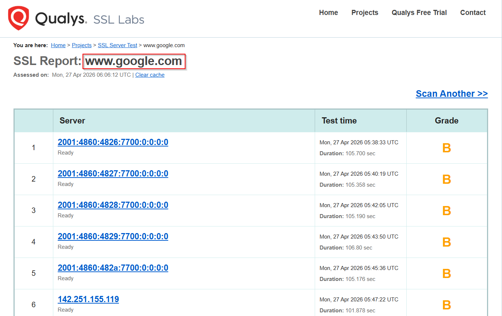
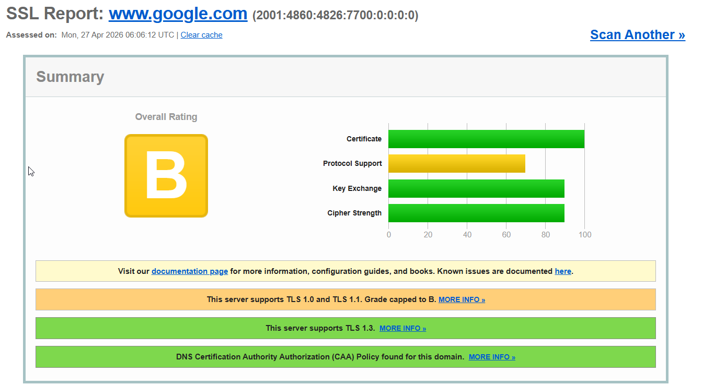
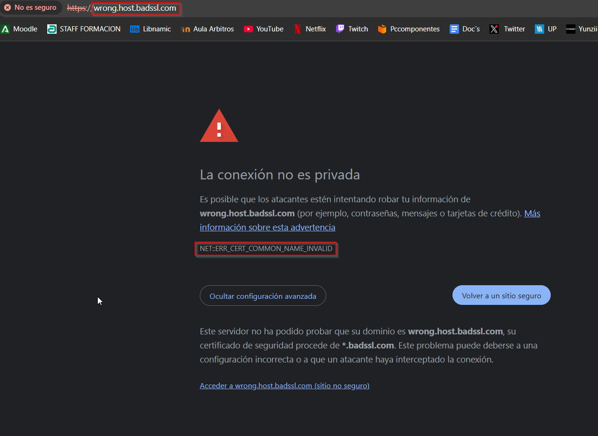
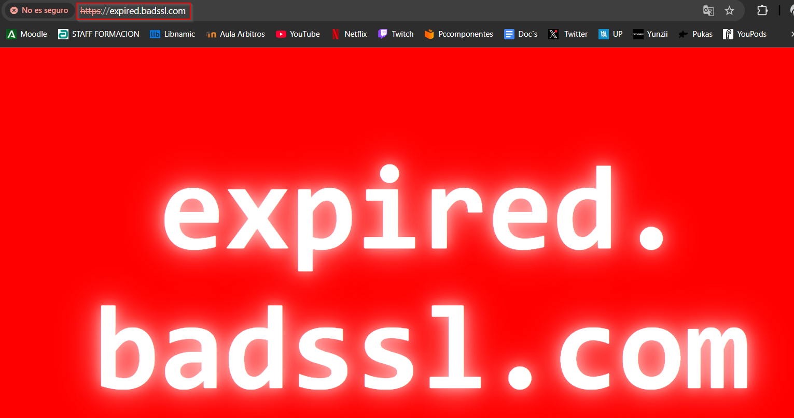
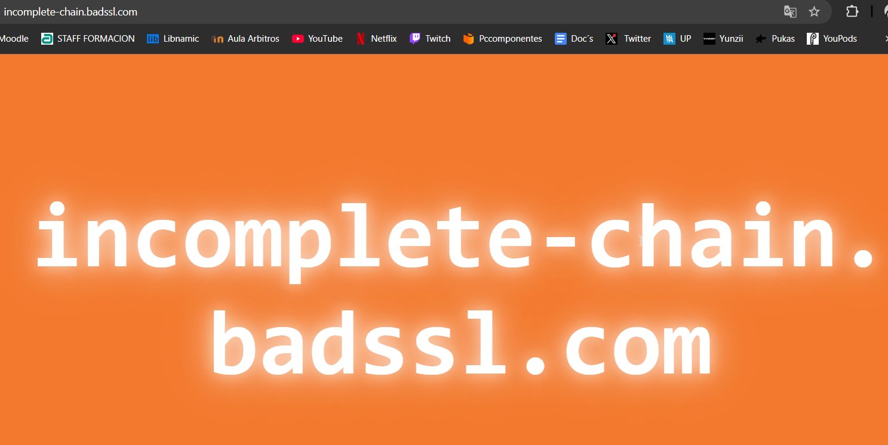

# Parte 3 

## 1. Metodologia
- Servicio usado para analisis: SSL Labs
- Fecha de evaluacion: 27/04/2026
- Via elegida: Simulada

## 2. Certificado valido analizado

### 2.1 Objetivo analizado
- Dominio: www.google.com
- Tipo de certificado: DV

### 2.2 Evidencias del servicio

### 2.3 Motivos de validez (completar con resultados reales)
- El dominio analizado responde con un certificado emitido por una CA publica reconocida.
- El nombre del dominio coincide con el CN y con el SAN del certificado.
- El certificado se encuentra dentro de su periodo de validez.
- SSL Labs muestra un informe funcional del servicio y permite comprobar su configuracion.
- La nota global B no invalida el certificado; indica aspectos de configuracion TLS que pueden mejorarse, pero el certificado sigue siendo valido.

**Analisis de las capturas:**
- La captura 1 muestra el resumen del informe de SSL Labs para www.google.com.
- La captura 2 muestra el detalle del analisis del certificado y del servidor.
- El resultado confirma autenticidad del certificado y correcta asociacion con el dominio.

## 3. Certificados invalidos (3 casos distintos)

## 3.1 Caso invalido A - Certificado expirado
- URL objetivo: https://expired.badssl.com/
- Tipo de error esperado: Certificado vencido.

**Captura:** 

**Analisis:**
- El periodo Not After ya fue superado.
- El navegador/servicio rechaza la confianza por validez temporal invalida.
- Riesgo: no se puede garantizar mantenimiento ni identidad vigente.

**Motivo de invalidez:** el certificado ya no esta dentro de la ventana temporal aceptada, por lo que el cliente lo rechaza aunque la configuracion restante fuese correcta.

## 3.2 Caso invalido B - Hostname no coincide
- URL objetivo: https://wrong.host.badssl.com/
- Tipo de error esperado: Mismatch entre dominio y CN/SAN.

**Captura:** 

**Analisis:**
- El nombre solicitado no aparece en SAN/CN del certificado.
- El cliente no puede confirmar que ese certificado pertenezca al dominio visitado.
- Riesgo de suplantacion o configuracion incorrecta.

**Motivo de invalidez:** el navegador detecta que el certificado no corresponde al host solicitado y devuelve un error de nombre comun no valido.

## 3.3 Caso invalido C - Cadena de confianza incorrecta
- URL objetivo: https://incomplete-chain.badssl.com/
- Tipo de error esperado: Cadena incompleta o CA no confiable.

**Captura:** 

**Analisis:**
- Falta uno o mas certificados intermedios o la CA raiz no es confiable.
- La validacion no alcanza una ancla de confianza aceptada.
- Riesgo: el cliente no puede autenticar el servidor.

**Motivo de invalidez:** la cadena no llega a una autoridad confiable, de modo que el cliente no puede verificar la autenticidad del servidor.

## 4. Comparativa global

| Criterio | Sitio valido | Invalido A (expirado) | Invalido B (hostname) | Invalido C (cadena) |
|---|---|---|---|---|
| Estado general | Valido | Invalido | Invalido | Invalido |
| Motivo principal | Certificado emitido por CA publica reconocida y dominio correcto | Certificado vencido | CN/SAN no coincide | Cadena incompleta o CA no confiable |
| Confianza navegador | Alta | Bloqueada/Advertencia | Bloqueada/Advertencia | Bloqueada/Advertencia |
| Posible solucion | Ninguna; el certificado es correcto | Renovar certificado | Corregir SAN/CN | Instalar intermedios/CA valida |

## 5. Conclusiones
1. El certificado valido de www.google.com supera la verificacion porque esta emitido por una CA publica reconocida y coincide con el dominio analizado.
2. Los tres casos invalidos representan fallos distintos: expiracion, coincidencia de nombre y cadena de confianza.
3. Como recomendacion, conviene revisar fechas de caducidad, SAN/CN y cadena de certificados antes de publicar o renovar un sitio web.

## 6. Anexo de evidencias

| Evidencia | Archivo | Verificado |
|---|---|---|
| Valido resumen | img/6.png | SI |
| Valido detalle | img/7.png | SI |
| Invalido expirado | img/8.png | SI |
| Invalido hostname | img/9.png | SI |
| Invalido cadena | img/10.png | SI |
