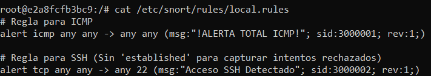
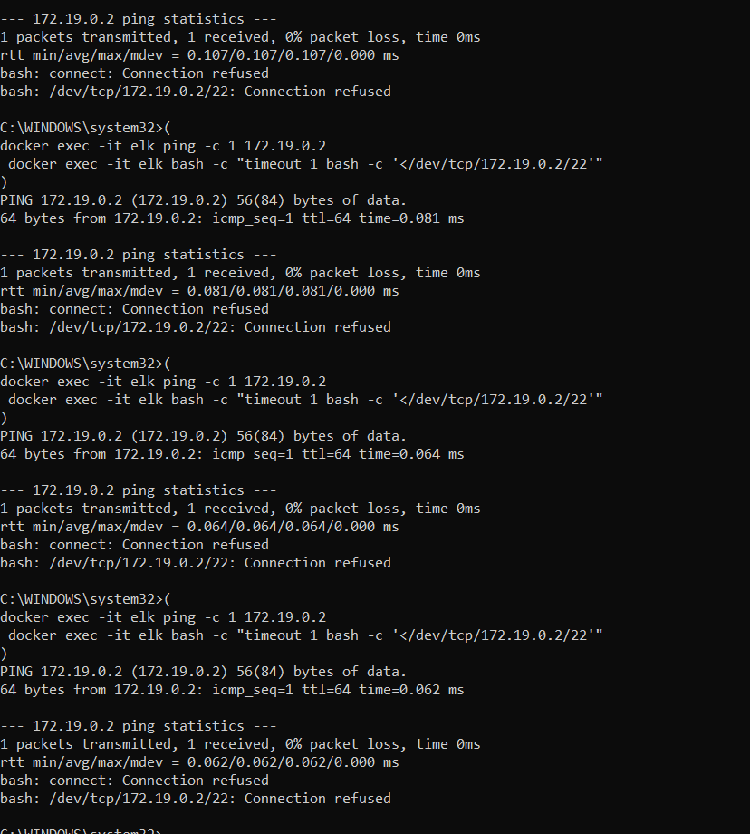
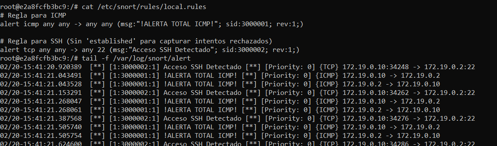
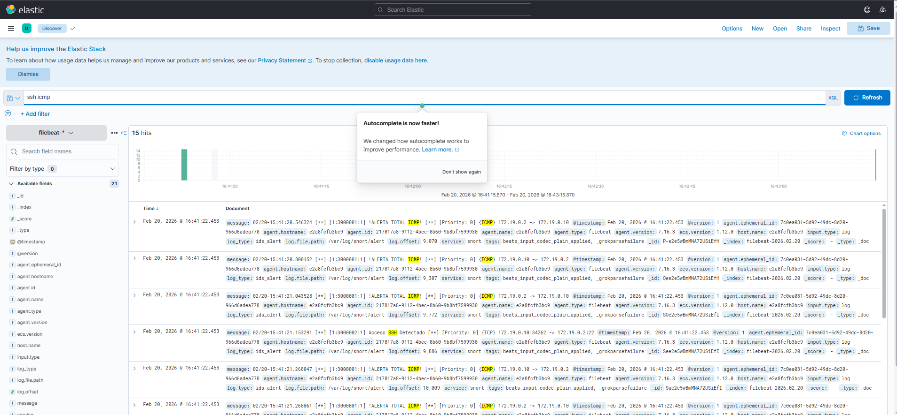

# Implementación Técnica del Caso de Uso: Detección de Intrusion (Snort)

Este documento describe la configuración detallada de Snort y Filebeat para detectar y alertar sobre ataques de fuerza bruta SSH y tráfico ICMP en la red.

## 1. Arquitectura de Detección
Se implementa una solución distribuida donde el agente Snort detecta anomalías en el endpoint y Filebeat las envía centralmente al SIEM (ELK).

*   **Snort:** IDS (Intrusion Detection System) instalado en el contenedor endpoint (`nginx-filebeat`).
*   **Filebeat:** Agente de envío de logs (`filebeat-syslog` y `filebeat-snort`).
*   **Objetivo:** Permitir al SOC detectar ataques de diccionario dirigidos a SSH.

## 2. Configuración de Snort (IDS)

### 2.1. Archivo de Configuración Principal (`snort.conf`)
Se modificó `/etc/snort/snort.conf` para incluir el archivo de reglas locales:
```conf
include $RULE_PATH/local.rules
```
Se ajustó la configuración de red (`ipvar HOME_NET`) para que coincida con la subred del contenedor Docker (`172.20.0.0/24`).


### 2.2. Reglas Locales (`local.rules`)
Las siguientes reglas se añadieron a `/etc/snort/rules/local.rules` para implementar el caso de uso.

**Regla 1: Detección de Tráfico ICMP (Ping)**
Detecta cualquier paquete ICMP.
```snort
alert icmp any any -> any any (msg:"!ALERTA TOTAL ICMP!"; sid:3000001; rev:1;)
```

**Regla 2: Detección de Intentos SSH**
Detecta tráfico TCP dirigido al puerto 22 (SSH), sin filtrar por estado de conexión para capturar también los intentos rechazados.
```snort
alert tcp any any -> any 22 (msg:"Acceso SSH Detectado"; sid:3000002; rev:1;)
```

> 


## 3. Integración con Filebeat

Para que las alertas de Snort lleguen a Kibana, Filebeat debe leer el archivo de logs de Snort.

**Configuración en `filebeat.yml`:**
Se añadió un módulo o input específico para leer los logs de alerta rápida de Snort (`/var/log/snort/alert`).

```yaml
filebeat.inputs:
- type: log
  enabled: true
  paths:
    - /var/log/snort/alert
  fields:
    type: snort_alert
```


## 4. Validación y Pruebas (PoC)

### 4.1. Generación de Ataque y Comprobación
Para verificar la conectividad y generar tráfico que active las reglas (ICMP y SSH), se utilizó el siguiente script en bucle desde el host (Windows CMD). Esto simula intentos de conexión repetidos hacia el contenedor endpoint (`172.19.0.2`):

```cmd
for /l %i in (1,1,5) do (
   docker exec -it elk ping -c 1 172.19.0.2
   docker exec -it elk bash -c "timeout 1 bash -c '</dev/tcp/172.19.0.2/22'"
)
```

> 


### 4.2. Verificación en Snort
Se verificó que Snort estuviera generando alertas localmente:
```bash
tail -f /var/log/snort/alert
```
> 

### 4.3. Visualización en Kibana (Dashboard)
Finalmente, se verificó que las alertas aparecieran en el índice de Filebeat en Kibana. Se creó una visualización (Data View) filtrando por `snort_alert`.

> 

## 5. Conclusiones
La implementación permite detectar eficazmente intentos de reconocimiento y acceso no autorizado. La integración con ELK centraliza estas alertas, permitiendo un análisis correlacionado en el SOC.
