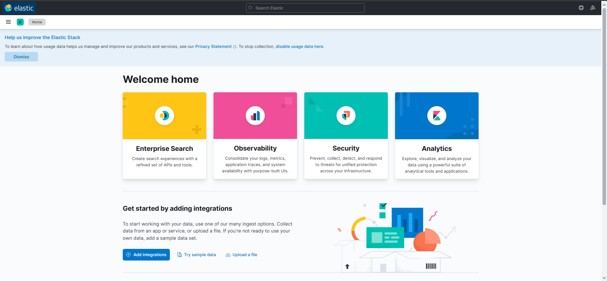

# Instalación y Configuración del SIEM (ELK + Snort)

Este documento detalla el proceso técnico seguido para el despliegue de la infraestructura de monitoreo y detección de intrusiones.

## 1. Requisitos Previos e Infraestructura
El despliegue se realiza sobre **Docker Desktop** en un entorno Windows/Linux. La arquitectura consta de dos contenedores principales conectados a una red interna bridge.

*   **Contenedor 1 (SIEM):** Elasticsearch, Logstash, Kibana (Imagen `sebp/elk:7.16.3`).
*   **Contenedor 2 (Endpoint/IDS):** Nginx, Filebeat, Snort (Imagen personalizada basada en `nginx-filebeat`).
*   **Red:** `elk-red` (Subred `172.20.0.0/24`).

## 2. Instalación de Docker y Preparación del Host
1.  **Instalar Docker Desktop**: Descargado desde [docker.com](https://www.docker.com/products/docker-desktop).
2.  **Ajuste de Memoria Virtual (Elasticsearch):**
    Para evitar el error `max virtual memory areas vm.max_map_count [...] is too low`, se ejecutó en la terminal (WSL/Linux):
    ```bash
    sysctl -w vm.max_map_count=262145
    ```


    *Para persistencia en Linux, añadir `vm.max_map_count=262145` en `/etc/sysctl.conf`.*

## 3. Despliegue del Entorno ELK (SIEM)

**1. Crear la red de Docker:**
Para asegurar comunicación interna y IPs estáticas:
```bash
docker network create -d bridge --subnet 172.20.0.0/24 elk-red
```


**2. Descargar la imagen:**
```bash
docker pull sebp/elk:7.16.3

```

**3. Ejecutar el contenedor ELK:**
Se exponen los puertos 5601 (Kibana), 9200 (Elasticsearch) y 5044 (Logstash entrada Beats).
```bash
docker run -p 5601:5601 -p 9200:9200 -p 5044:5044 -it \
  --name elk --net elk-red --ip 172.20.0.10 \
  -d sebp/elk:7.16.3
```


> 

## 4. Configuración del Endpoint con Snort y Filebeat

El objetivo es tener un contenedor que sirva web (Nginx), detecte intrusiones (Snort) y envíe logs al SIEM (Filebeat).

### 4.1. Preparación de la Imagen del Agente
Se partió del repositorio `elk-docker` y se modificó para incluir Snort.

**Dockerfile utilizado:**
*(Incluir aquí el contenido del Dockerfile si se creó uno, o explicar la instalación manual)*

**Instalación manual de Snort en el contenedor:**
1.  Acceder al contenedor: `docker exec -it filebeat bash`
2.  Instalar Snort:
    ```bash
    apt-get update && apt-get install snort -y
    ```
3.  [Insertar captura de pantalla aquí: Salida del comando snort --version]] `snort --version`

> 

### 4.2. Configuración de Filebeat
Se modificó `/etc/filebeat/filebeat.yml` para enviar datos a Logstash (IP 172.20.0.10) y desactivar SSL para facilitar la comunicación en este entorno de pruebas.

```yaml
output.logstash:
  hosts: ["172.20.0.10:5044"]
  ssl.enabled: false
```

> ![[Insertar captura de pantalla aquí: Archivo filebeat.yml modificado]]

### 4.3. Configuración de Logstash (en el contenedor ELK)
Se deshabilitó SSL en el input de Beats para que coincida con la configuración de Filebeat.
Archivo: `/etc/logstash/conf.d/02-beats-input.conf`
```conf
input {
  beats {
    port => 5044
    ssl => false
  }
}
> ![[Insertar captura de pantalla aquí: Archivo 02-beats-input.conf modificado en el contenedor ELK]]

```

## 5. Solución de Problemas Encontrados

| Problema | Causa | Solución |
| :--- | :--- | :--- |
| Error `vm.max_map_count` | Memoria virtual insuficiente para Elasticsearch. | Ejecutar `sysctl -w vm.max_map_count=262145`. |
| Filebeat no conecta con Logstash | Error de certificados SSL/TLS. | Desactivar SSL en `filebeat.yml` y en `02-beats-input.conf` de Logstash. |
| Snort no detecta tráfico | Interfaz de red incorrecta por defecto. | Asegurar que Snort escuche en `eth0` (o la interfaz correcta del contenedor). |
